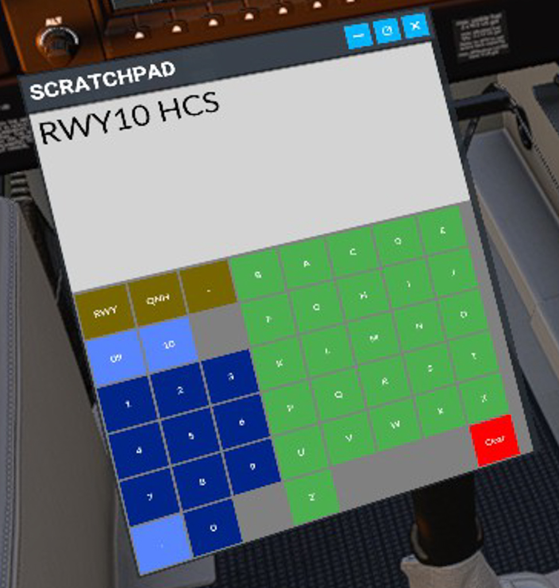

# MSFS2020 Scratchpad (for VR)

Simple scratchpad to take notes while flying VR.

NEEDS A LOCAL OR REMOTE WEBSERVER!

Notes will not be saved (yet)!

Based on the toolbar window template from
https://github.com/bymaximus/msfs2020-toolbar-window-template

## Installation

- Host content of "webserver-content" in some webserver. It does not matter if its running lokal or somewhere else.
- Make sure you can reach "sratchpad.html" with a browser and copy the URL
- Paste the URL into "debgz-scratchpad/html_ui/InGamePanels/ScratchPanel/ScratchPanel.js" on line 19 and 80
- Remove "Build" from "debgz-scratchpad"
- Copy complete "debgz-scratchpad" folder into your MSFS community folder

### msfs2020-toolbar-window-template
Microsoft FlightSimulator 2020 Toolbar Extra Window Template, this example loads UI window with SkyVector website.

To build the SPB if you have changed UI panel template definition

`SDK\Tools\bin\fspackagetool.exe fs-base-ingamepanels-custom\Build\fs-base-ingamepanels-custom.xml -nomirroring`

It will generate the SPB at `fs-base-ingamepanels-custom\Build\Packages\fs-base-ingamepanels-custom\Build` copy the SPB to `fs-base-ingamepanels-custom\InGamePanels`.

Copy the package to community folder BUT DO NOT COPY the `fs-base-ingamepanels-custom\Build` directory.